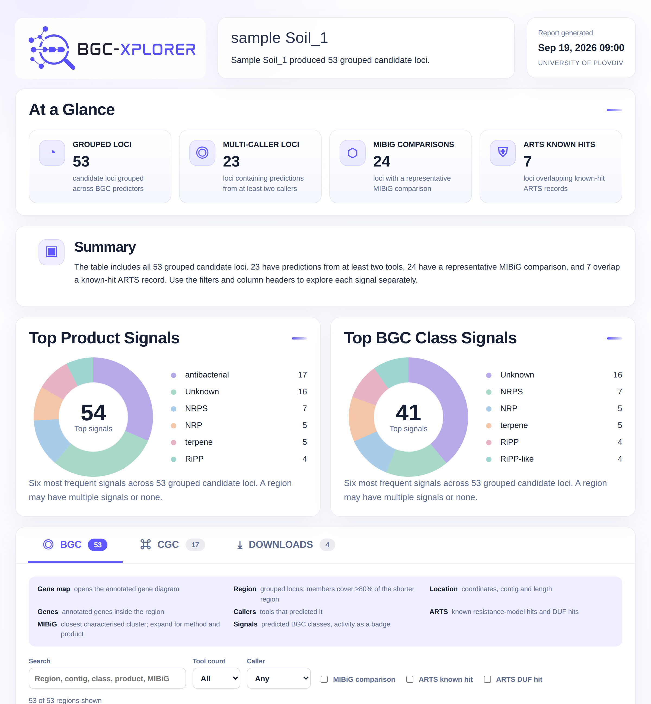

<p align="center">
  
</p>

<h1 align="center">BGC-XPLORER</h1>

<p align="center">
  A reproducible web application for discovering, comparing and interpreting biosynthetic gene clusters in bacterial genomes.
</p>

BGC-XPLORER accepts a bacterial genome in FASTA format and runs an integrated natural-product discovery workflow. It annotates the genome, compares predictions from several BGC callers, adds functional and resistance evidence, and produces an interactive HTML report. The report shows every grouped candidate locus in one searchable table with sortable caller, ARTS and MIBiG signals. Optional NVIDIA-hosted AI analysis explains individual clusters from the collected evidence.

<p align="center">
  
</p>

## What it does

- Accepts `.fa`, `.fasta` and `.fna` genome files through a web interface.
- Annotates the genome with **Bakta**.
- Detects BGC candidates with **antiSMASH**, **GECCO** and **DeepBGC**.
- Adds **ARTS**, **eggNOG-mapper** and **dbCAN** evidence.
- Groups predictions into candidate loci by counting callers per gene: a locus is the run of genes at least two of the three callers place inside a cluster, and a prediction no run covers is kept whole. The reported coordinates are that agreed span, while the gene tables and maps cover the full extent of the contributing predictions, so no gene any caller reported is dropped.
- Reports core-gene roles as evidence rather than as a grouping criterion. Roles come from explicit antiSMASH biosynthetic roles and a conservative scaffold-forming Pfam set applied to GECCO or DeepBGC output, with a strict Bakta annotation fallback only when a predictor provides no resolvable role.
- Lets users filter and sort the full result table by caller, tool count, ARTS signal, MIBiG comparison, coordinates and predicted class, in a BGC tab beside a CGC substrate tab.
- Compares antiSMASH regions with MIBiG using KnownClusterBlast and ClusterCompare; reports the score metric for each representative match.
- Generates interactive gene maps, summary tables and reproducibility metadata; every completed sample also gets a `provenance.json` with tool versions, configuration and input checksums.
- Offers the BGC and CGC tables and the Bakta and eggNOG annotations for download straight from the report.
- Uses a configurable NVIDIA AI model for evidence-grounded cluster interpretation.

## Quick start with Docker

You need [Docker Engine](https://docs.docker.com/engine/install/) with the Docker Compose plugin. The analysis tools are already included in the container. Reference databases are stored outside the image and downloaded automatically during the first start.

```bash
git clone https://github.com/vebaev/BGC-XPLORER.git
cd BGC-XPLORER
cp .env.example .env
```

Open `.env` and replace the placeholder with your [NVIDIA API key](https://build.nvidia.com/):

```dotenv
NVIDIA_API_KEY=your-nvidia-api-key
NVIDIA_MODEL=nvidia/nemotron-3-ultra-550b-a55b
BGC_PORT=8778
BGC_THREADS=8
BAKTA_DB_TYPE=light
```

Start the application:

```bash
docker compose up -d
```

Open **http://localhost:8778**, upload a bacterial genome FASTA file and start the analysis. Follow startup or analysis logs with:

```bash
docker compose logs -f
```

Stop the application with `docker compose down`. Your inputs, databases and results remain in the mounted `data/`, `db/` and `results/` directories.

> The first start can take considerable time and disk space because the biological reference databases must be downloaded. Completed databases are reused and are not automatically upgraded on later starts.

## Configuration

The main settings live in `.env`:

| Variable | Default | Purpose |
| --- | --- | --- |
| `NVIDIA_API_KEY` | required | API key used by the optional AI interpretation service. |
| `NVIDIA_MODEL` | Set in `.env` | NVIDIA-hosted model used in reports; the example above uses Nemotron 3 Ultra. |
| `BGC_PORT` | `8778` | Port exposed on the host. |
| `BGC_THREADS` | `8` in `.env.example` | CPU limit shared by Snakemake and supported tools. |
| `BAKTA_DB_TYPE` | `light` | Bakta database: `light` for a smaller download or `full` for maximum coverage. |
| `AUTO_PREPARE_DATABASES` | `true` | Downloads missing databases before starting the app. |
| `ARTS_REFERENCE` | `actinobacteria` | Taxon-specific ARTS reference set. |
| `BGC_IMAGE` | `vebaev/bgc-xplorer` | GHCR image owner and name. |
| `BGC_VERSION` | `latest` | Container image tag to run. |

To use another port, model or CPU limit, edit `.env` and recreate the service:

```bash
docker compose up -d --force-recreate
```

## Reference databases

The container keeps reference data in the mounted `./db/` directory, outside the image. With `AUTO_PREPARE_DATABASES=true`, startup checks the selected **Bakta** database and the required **antiSMASH**, **DeepBGC**, **ARTS** (Actinobacteria) and **eggNOG-mapper** resources. Missing or incomplete databases are downloaded and validated before the web app starts. You can follow progress with `docker compose logs -f`.

Choose `BAKTA_DB_TYPE=light` for the smaller Bakta database or `BAKTA_DB_TYPE=full` for the full database. Both can coexist under `./db/bakta/`. The first download may take time and require substantial disk space. Later starts reuse valid databases without checking for new versions; an interrupted download is retried on the next start. Removing a specific database directory explicitly requests a fresh installation.

For the directory layout and manual preparation commands, see [Database setup](docs/database_setup.md).

## Citation

If you use BGC-XPLORER in research, cite the associated publication when its citation becomes available and report the release tag or commit used for the analysis.

## License

BGC-XPLORER's original code, documentation and images are licensed under [CC BY-NC-SA 4.0](LICENSE). Attribution is required, commercial use is not permitted, and adaptations must use the same license. Bundled third-party tools and downloaded databases keep their own licenses; review those terms before redistributing a container image.
