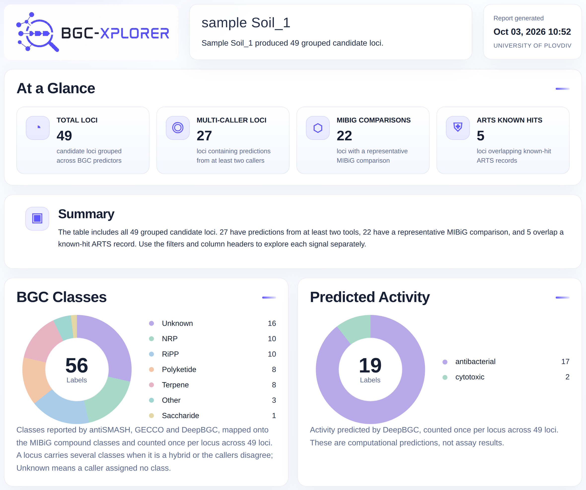

<p align="center">
  
</p>

<h1 align="center">BGC-XPLORER</h1>

<p align="center">
  A reproducible web application for discovering, comparing and interpreting biosynthetic gene clusters in bacterial genomes.
</p>

BGC-XPLORER accepts a bacterial genome in FASTA format and runs an integrated natural-product discovery workflow. It annotates the genome, compares predictions from several BGC callers, adds functional and resistance evidence, and produces an interactive HTML report. The report shows every grouped candidate locus in one searchable table with sortable caller, ARTS and MIBiG signals. An optional NVIDIA-hosted AI summary restates the main evidence for an individual cluster; AI models can make mistakes, and no result of the analysis depends on it.

<p align="center">
  
</p>

## What it does

- Accepts `.fa`, `.fasta` and `.fna` genome files through a web interface.
- Annotates the genome with **Bakta**.
- Detects BGC candidates with **antiSMASH**, **GECCO** and **DeepBGC**.
- Adds **ARTS**, **eggNOG-mapper** and **dbCAN** evidence.
- Groups predictions into candidate loci by counting callers per gene: a locus is the run of genes at least two of the three callers place inside a cluster, and a prediction no run covers is kept whole. The reported coordinates are that agreed span, while the gene tables and maps cover the full extent of the contributing predictions, so no gene any caller reported is dropped.
- Reports core-gene roles as evidence rather than as a grouping criterion. Roles come from explicit antiSMASH biosynthetic roles and a conservative scaffold-forming Pfam set applied to GECCO or DeepBGC output, with a strict Bakta annotation fallback only when a predictor provides no resolvable role.
- Lets users filter and sort the full result table by caller, tool count, ARTS signal, MIBiG comparison, coordinates and predicted class, in a BGC tab beside a CGC substrate tab.
- Compares antiSMASH regions with MIBiG using KnownClusterBlast and ClusterCompare; reports the score metric for each representative match.
- Generates interactive gene maps, summary tables and reproducibility metadata; every completed sample also gets a `provenance.json` with tool versions, configuration and input checksums.
- Offers the BGC and CGC tables and the Bakta and eggNOG annotations for download straight from the report.
- Uses a configurable NVIDIA AI model for evidence-grounded cluster interpretation.

## Quick start with Docker

You need [Docker Engine](https://docs.docker.com/engine/install/) with the Docker Compose plugin. The analysis tools are already included in the container. Reference databases are stored outside the image and downloaded automatically during the first start.

```bash
git clone https://github.com/vebaev/BGC-XPLORER.git
cd BGC-XPLORER
cp .env.example .env
```

Open `.env` and replace the placeholder with your [NVIDIA API key](https://build.nvidia.com/):

```dotenv
NVIDIA_API_KEY=your-nvidia-api-key
NVIDIA_MODEL=nvidia/nemotron-3-ultra-550b-a55b
BGC_PORT=8778
BGC_THREADS=8
BAKTA_DB_TYPE=light
```

Start the application:

```bash
docker compose up -d
```

Open **http://localhost:8778**, upload a bacterial genome FASTA file and start the analysis. Follow startup or analysis logs with:

```bash
docker compose logs -f
```

Stop the application with `docker compose down`. Your inputs, databases and results remain in the mounted `data/`, `db/` and `results/` directories.

> The first start can take considerable time and disk space because the biological reference databases must be downloaded. Completed databases are reused and are not automatically upgraded on later starts.

To check an installation, run the 320 kb test genome in `example/` (a fragment of GenBank CP158056.1, positions 1,200,001–1,520,000, with two complete loci): upload `example/STR-S001_CP158056.1_1200001-1520000.fasta` in the web interface, or copy it into `data/fasta/` as `STR_S001_test.fasta` and add `STR_S001_test	actinobacteria` to `config/samples.tsv`. A complete run reports the loci listed in `example/expected_loci.tsv`; it takes about 73 min with 16 threads.

## Configuration

The main settings live in `.env`:

| Variable | Default | Purpose |
| --- | --- | --- |
| `NVIDIA_API_KEY` | required | API key used by the optional AI interpretation service. |
| `NVIDIA_MODEL` | `nvidia/nemotron-3-ultra-550b-a55b` | NVIDIA-hosted model for the optional AI summary. This is the recommended model, used for the results reported in the paper; outputs from other models, or later versions of this one, are not comparable. |
| `BGC_PORT` | `8778` | Port exposed on the host. |
| `BGC_THREADS` | `8` in `.env.example` | CPU limit shared by Snakemake and supported tools. |
| `BAKTA_DB_TYPE` | `light` | Bakta database: `light` for a smaller download or `full` for maximum coverage. |
| `AUTO_PREPARE_DATABASES` | `true` | Downloads missing databases before starting the app. |
| `ARTS_REFERENCE` | `actinobacteria` | Taxon-specific ARTS reference set. |
| `BGC_IMAGE` | `vebaev/bgc-xplorer` | GHCR image owner and name. |
| `BGC_VERSION` | `1.2.2` | Container image tag to run; pinned to the release the manuscript describes. |

To use another port, model or CPU limit, edit `.env` and recreate the service:

```bash
docker compose up -d --force-recreate
```

### Execution modes

`execution.mode` in `config/config.yaml` selects how the tools are run:

| Mode | What it does |
| --- | --- |
| `local` (default) | Runs every tool inside the BGC-XPLORER container. Use this for analysis. |
| `docker` | Runs each tool in its own container image, set under `tools.<name>.container`. |
| `mock` | Writes small placeholder outputs without running the tools or needing the databases. For testing the workflow and the interface only; its results are not biological. |

### Grouping of caller predictions

antiSMASH, GECCO and DeepBGC predictions are grouped gene by gene on the Bakta gene set. A caller votes for a gene when its predicted region covers the gene; a locus is a run of consecutive genes that each carry enough votes. A single gene below the threshold ends the run, a caller region spanning two runs is split between them, and neighbouring regions inside one run are joined. Predictions that no run covers are kept as single-caller loci. The reported coordinates are the agreed span; the gene map shows the full extent of the contributing predictions.

The rule is set under `consensus` in `config/config.yaml`:

| Key | Default | Meaning |
| --- | --- | --- |
| `mode` | `voting` | `voting` is the rule above; `containment` restores the earlier pairwise rule. |
| `min_callers_per_gene` | `2` | Callers that must cover a gene for it to join a locus. |
| `min_gene_overlap_fraction` | `0.0` | Fraction of a gene a prediction must cover to vote for it; `0` counts any overlap of 1 bp or more. |
| `min_genes_per_locus` | `1` | Shortest run of agreed genes reported as a multi-caller locus. |

## Validation and showcase scripts

`validation/` holds the benchmark of the grouping against 42 MIBiG 4.0 loci in four genomes (*Streptomyces coelicolor* A3(2), *S. albidoflavus* J1074, *S. avermitilis* MA-4680, *Salinispora tropica* CNB-440): truth sets, the callers' tables from each run, every grouping variant, metrics, figures and tables. The results can be re-scored from these files:

```bash
cd validation
mamba env create -p .env -f environment.yaml
.env/bin/python -m pytest -q test_validate_consensus.py
.env/bin/python validate_consensus.py --workdir work --variants variants --truth-dir truth \
    --samples S_coelicolor_A3_2,S_albidoflavus_J1074,S_avermitilis_MA4680,S_tropica_CNB440 --out metrics
.env/bin/python make_figures.py --metrics metrics --out figures && .env/bin/python make_tables.py
```

From scratch, build the truth sets with `build_truth.py`, run the workflow with `run_benchmark_container.sh` and score with `run_validation.sh`; `bgcquast_crosscheck.py` repeats the check with BGC-QUAST 1.1.0.

`showcase/loci_table.py` and `showcase/caller_upset.py` build the per-locus table and the UpSet plot of caller support from a finished run (`--results results --sample <sample> --out <file>`).

## Reference databases

The container keeps reference data in the mounted `./db/` directory, outside the image. With `AUTO_PREPARE_DATABASES=true`, startup checks the selected **Bakta** database and the required **antiSMASH**, **DeepBGC**, **ARTS** (Actinobacteria) and **eggNOG-mapper** resources. Missing or incomplete databases are downloaded and validated before the web app starts. You can follow progress with `docker compose logs -f`.

Choose `BAKTA_DB_TYPE=light` for the smaller Bakta database or `BAKTA_DB_TYPE=full` for the full database. Both can coexist under `./db/bakta/`. The first download may take time and require substantial disk space. Later starts reuse valid databases without checking for new versions; an interrupted download is retried on the next start. Removing a specific database directory explicitly requests a fresh installation.

**dbCAN is optional** and is the one resource without an automatic download. To add CAZyme gene clusters and substrate predictions to the report, place a dbCAN v5 database in `./db/dbcan/`; it must contain `dbCAN.hmm`, `dbCAN-sub.hmm` and `CAZy.dmnd` (see the [run_dbcan documentation](https://github.com/linnabrown/run_dbcan) for how to prepare it). Without it the workflow runs normally and the report shows no CAZyme gene clusters.

For the directory layout and manual preparation commands, see [Database setup](docs/database_setup.md).

## Citation

If you use BGC-XPLORER in research, cite the associated publication when its citation becomes available and report the release tag or commit used for the analysis.

## License

BGC-XPLORER's original code, documentation and images are released under the [MIT License](LICENSE). Bundled third-party tools and downloaded databases keep their own licenses; review those terms before redistributing a container image.
